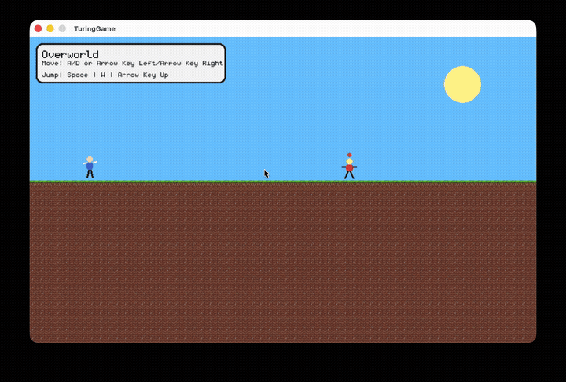

# TuringGame

A short narrative platformer with turn-based mechanics about the **ethical use of AI**.
Explore the overworld, get into "battles", and see how your decisions play out.

Built with Python + pygame, and playable in the browser via a pygbag/WebAssembly build.

[](https://github.com/nuclearBulldog/TuringGame/actions/workflows/ci.yml)

**[Play in your browser](ADD_DEMO_URL_HERE)** | Desktop install below



# Installation Guide

## Linux/MacOS

### Prerequisites

- **git**
- python **3.10**

```bash
# MacOS
$ brew install git python3.10

# Arch Linux
$ sudo pacman -S git python3.10

# Fedora
$ sudo dnf install git python3.10

# Debian/Ubuntu
$ sudo apt install git python3.10

# gentoo
sudo emerge --ask --verbose dev-lang/python:3.10 dev-vcs/git

```

### Installation

#### 1. Open a new terminal and clone the repository
```bash
$ git clone https://github.com/nuclearBulldog/TuringGame.git
$ cd TuringGame
```

#### 2. Create and activate the Virtual Environment
```bash
$ mkdir .venv
$ python3.10 -m venv .venv
$ source .venv/bin/activate
```
#### 3. Install Dependencies
```bash
$ pip install -r requirements.txt
```
This will install:
- `pygame~=2.6.1`
- `pytest~=9.0.3`
- `pygame-menu~=4.5.2`

```bash
$ cd turing-game
$ python main.py
```
---

Windows
---
---
disclaimer: the windows installation guide was written using AI as i do not have a windows machine, keep in mind this may be incorrect

### Prerequisites
- Python **3.10** ([download here](https://www.python.org/downloads/))
- **Git** ([download here](https://git-scm.com/download/win))

### Installation

#### 1. Open Command Prompt (cmd) or PowerShell and run:
```bash
> git clone https://github.com/nuclearBulldog/TuringGame.git
> cd TuringGame
```

#### 2. Create and activate the Virtual Environment
```bash
> mkdir .venv
> python -m venv .venv
> .venv\Scripts\activate
```
You should see `(venv)` appear at the beginning of your command line prompt.

#### 3. Install Dependencies
```bash
> pip install -r requirements.txt
```

This will install:
- `pygame~=2.6.1`
- `pytest~=9.0.3`
- `pygame-menu~=4.5.2`

### Run the Game
```bash
> cd turing-game
> python main.py
```

## Deactivating the Virtual Environment

When you're finished, deactivate the virtual environment by running:
```bash
deactivate
```

## Running the tests

From the repo root, with the virtual environment activated:

```bash
$ pytest
```

The test suite (47 tests) runs headless, so no window or audio device required.

---
