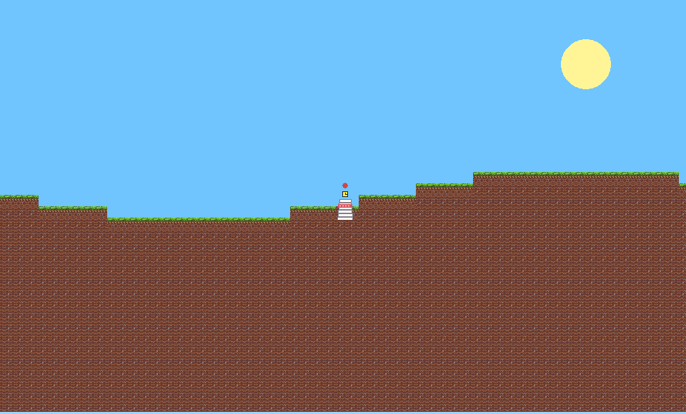
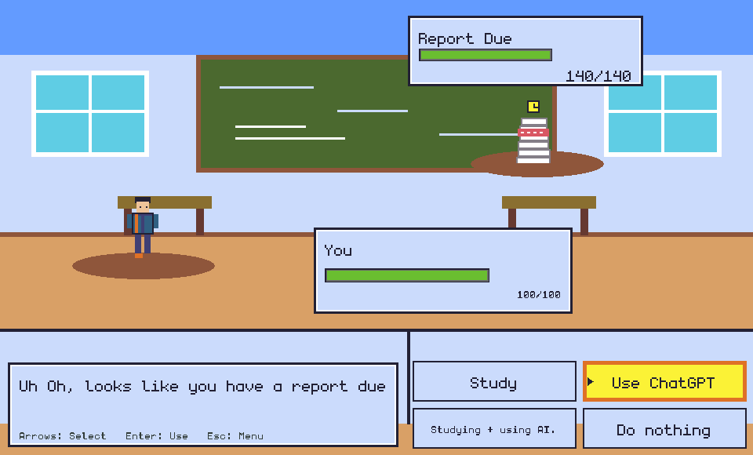
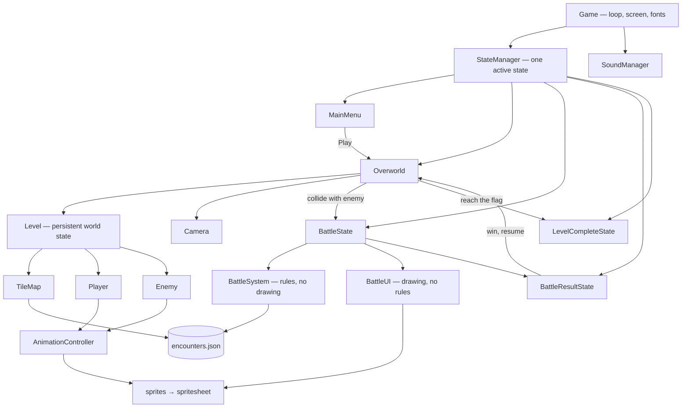

# TuringGame

A short narrative platformer with turn-based battles about the **ethical use of AI**,
aimed at undergraduates. Explore the overworld, walk into an AI-ethics dilemma, and
fight it out as a turn-based encounter where your choices are the moves.

Built with Python 3.11 + pygame.

[](https://github.com/nuclearBulldog/TuringGame/actions/workflows/ci.yml)


| Overworld | Battle |
|---|---|
|  |  |

---

## Quickstart

Requires **Python 3.11** and **git**.

```bash
git clone https://github.com/nuclearBulldog/TuringGame.git
cd TuringGame
python3.11 -m venv .venv
source .venv/bin/activate          # Windows: .venv\Scripts\activate
pip install -r requirements.txt
python -m turing_game
```

<details>
<summary>Installing Python 3.11 on Linux</summary>

```bash
sudo apt install git python3.11        # Debian/Ubuntu
sudo dnf install git python3.11        # Fedora
sudo pacman -S git python              # Arch
```
</details>

> The Windows commands are untested — I don't have a Windows machine. If something
> is off there, an issue or PR is welcome.

**Controls** — `A`/`D` or arrows to move, `Space`/`W`/`Up` to jump, arrows + `Enter`
to pick a battle move, `M` to mute, `Esc` to back out.

---

## How it's built

The design goal was to keep **game rules, presentation, and content** independent of
each other, so each can be tested or changed without touching the other two.



**Three decisions worth calling out:**

- **Rules are separated from rendering.** [`BattleSystem`](turing_game/systems/battle_system.py)
  holds the turn order, damage, and scoring and imports no drawing code at all;
  [`BattleUI`](turing_game/ui/battle_ui.py) owns the hit-flash and shake timers. That
  split is why the battle logic reaches 100% test coverage without ever opening a display.

- **Content is data, not code.** Encounters live in
  [`encounters.json`](turing_game/data/encounters/encounters.json) — enemy, intro text,
  four moves, optional scripted endings, and the level tile id that spawns them. Adding
  a new AI-ethics scenario is a JSON entry plus a tile number, no Python.

- **The world persists across a battle.** [`Level`](turing_game/world/level.py) owns the
  tile map, player, enemies, cleared set, and running score, so the
  Overworld → Battle → Result → Overworld round trip resumes the *same* world instead
  of rebuilding it. Defeated enemies stay defeated.

### Layout

```
turing_game/
├── engine/     StateManager, Camera            framework, no game rules
├── states/     MainMenu, Overworld, Battle…    one class per screen
├── systems/    BattleSystem, sprites, audio    rules and asset loading
├── entities/   Player, Enemy                   physics and collision
├── world/      Level, TileMap                  level loading and persistence
├── ui/         BattleUI, ImageButton           drawing only
├── assets/     sprite sheets, font, audio
└── data/       levels (CSV) and encounters (JSON)
tests/          mirrors the package, runs headless
tools/          placeholder-art generator
```

---

## Development

```bash
pip install -r requirements-dev.txt
```

```bash
pytest                                    # 125 tests, headless: no window or audio device
ruff check turing_game tests tools        # lint
pytest --cov=turing_game --cov-report=term-missing
```

CI runs lint and the full suite on every push and PR, and fails the build if coverage
drops below 85%.

The suite runs entirely headless via SDL's dummy drivers, which is why the sheet loader
in [`spritesheet.py`](turing_game/systems/spritesheet.py) falls back to an unconverted
surface when no display exists.

### Regenerating placeholder art

```bash
python tools/gen_placeholder_art.py
```

Existing sheets are skipped, because several have since been replaced with hand-drawn
art. Pass `--force` only if you mean to overwrite them.

---

## Licence

MIT — see [LICENSE.txt](LICENSE.txt).
